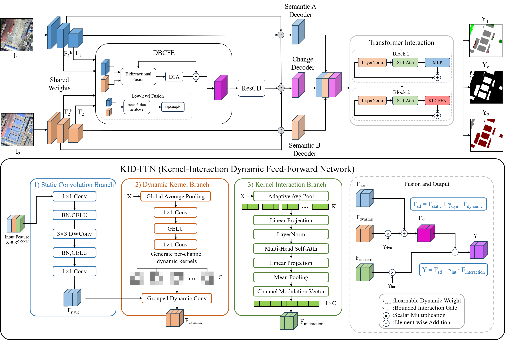

# DKI-Net

PyTorch implementation of **DKI-Net: Dynamic Kernel-Interaction Network for Semantic Change Detection in Remote Sensing Images**.

DKI-Net is designed for semantic change detection in bi-temporal remote sensing images. The network contains a Dual-scale Bidirectional Context Feature Enhancement module (DBCFE), a residual change-detection branch (ResCD), and a Transformer Interaction module. Its KID-FFN uses a static convolution branch, a dynamic kernel branch, and a kernel-interaction branch.

## Architecture



The main components are:

- **DBCFE**: Dual-scale Bidirectional Context Feature Enhancement for high- and low-level feature fusion.
- **ResCD**: Residual feature transformation for change representation.
- **Transformer Interaction**: Transformer-based interaction with dynamic kernels.
- **KID-FFN**: Kernel-Interaction Dynamic Feed-Forward Network with 5x5 dynamic kernels and 16 interacting kernels in the DKI-Net configuration.

## Requirements

The implementation uses Python and PyTorch. The main dependencies include:

```bash
pip install torch torchvision timm einops scikit-image opencv-python matplotlib scipy tensorboardX tqdm pillow
```

The torchvision ResNet-34 ImageNet weights are downloaded automatically on the first model initialization.

## Dataset

The current data loader expects the SECOND dataset in the following structure:

```text
DKI-Net/
└── data/
    └── SECOND/
        ├── train/
        │   ├── im1/
        │   ├── im2/
        │   ├── label1/
        │   └── label2/
        ├── val/
        │   ├── im1/
        │   ├── im2/
        │   ├── label1/
        │   └── label2/
        └── test/
            ├── im1/
            └── im2/
```

Images and labels should use matching file names. The loader converts the color-coded semantic labels into class-index maps.

## Training

From the project root:

```bash
python train_SCD.py
```

Training checkpoints, prediction previews, and TensorBoard logs are written under:

```text
checkpoints/DKI-Net/
results/DKI-Net/
logs/DKI-Net/DKI-Net/
```

## Prediction

After training, run prediction with the checkpoint path explicitly specified:

```bash
python pred_SCD.py \
  --test_dir data/SECOND/test \
  --pred_dir results/DKI-Net \
  --chkpt_path checkpoints/DKI-Net/<checkpoint>.pth
```

The prediction script writes semantic index maps and RGB visualization maps under the selected output directory.

## Evaluation

`Eval_SCD.py` evaluates semantic change-detection results against ground-truth labels. Before running it, set `INFER_DIR1`, `INFER_DIR2`, `LABEL_DIR1`, and `LABEL_DIR2` in the script to the corresponding prediction and label directories, then run:

```bash
python Eval_SCD.py
```

## Repository Structure

```text
DKI-Net/
├── datasets/                    # SECOND data loader
├── models/
│   ├── DKI_Net.py               # DKI-Net architecture
│   └── Transformer_Interaction.py
├── utils/                       # Losses, transforms, and evaluation utilities
├── train_SCD.py                 # Training entry point
├── pred_SCD.py                  # Prediction entry point
└── Eval_SCD.py                  # Evaluation script
```

## Citation

If you find this work useful, please cite:

```bibtex
@article{zhang2026dkinet,
  title   = {DKI-Net: Dynamic Kernel-Interaction Network for Semantic Change Detection in Remote Sensing Images},
  author  = {Zhang, Lili and Lv, Weidong and Wang, Gaoxu and Shi, Rui and Zhang, Xuejie},
  journal = {IEEE Journal of Selected Topics in Applied Earth Observations and Remote Sensing},
  year    = {2026}
}
```
